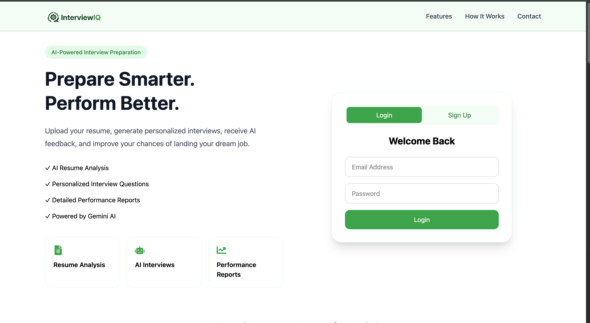
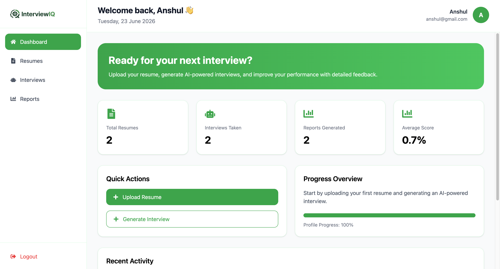
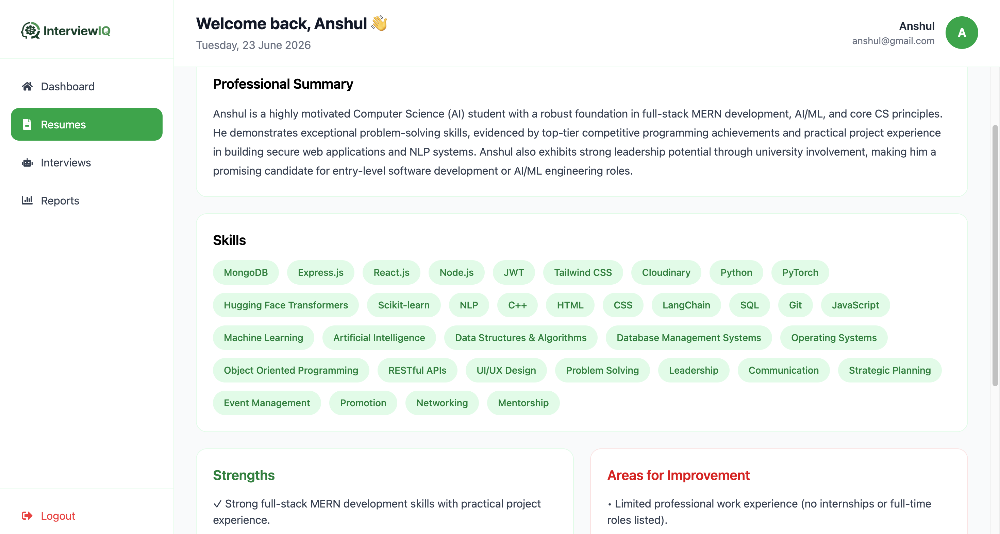
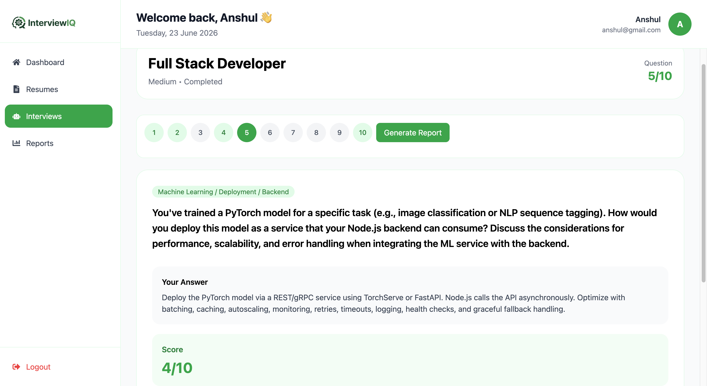
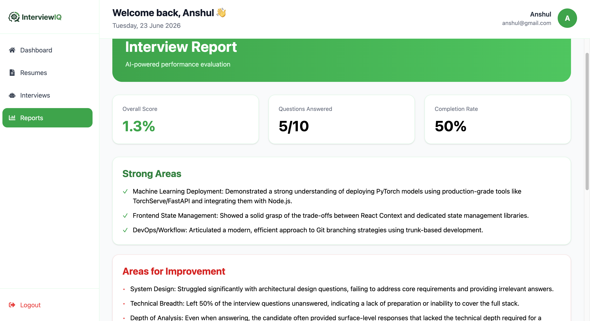

# 🚀 InterviewIQ

> An AI-powered interview preparation platform that analyzes resumes, generates personalized mock interviews, evaluates answers using Google Gemini, and provides detailed performance reports.

## 🔗 Live Demo

👉 [InterviewIQ](https://interview-iq-woad-nine.vercel.app/)

---

## 📌 Overview

InterviewIQ helps candidates prepare for technical interviews through AI-driven mock interview experiences.

The platform analyzes a user's resume, identifies strengths and weaknesses, generates customized interview questions, evaluates responses, and creates comprehensive performance reports with actionable feedback.

Built using the MERN stack, LangChain, and Google Gemini.

---

# ✨ Features

## 🔐 Authentication

* User Registration
* User Login
* JWT Authentication
* Protected Routes
* Persistent Sessions

## 📄 Resume Analysis

* Upload Resume (PDF)
* AI-Powered Resume Analysis
* Skill Extraction
* Strength Detection
* Weakness Detection
* Resume Summary Generation

## 🎯 Interview Generation

* Resume-Based Interview Generation
* Role-Specific Questions
* Difficulty Levels

  * Easy
  * Medium
  * Hard
* AI-Generated Technical Questions

## 💬 Interview Experience

* One Question At A Time
* Resume Incomplete Interviews
* Skip Questions
* Real-Time AI Evaluation
* Per-Question Feedback
* Per-Question Scoring

## 📊 AI Performance Reports

* Overall Interview Score
* Strong Areas
* Weak Areas
* Improvement Recommendations
* Detailed Feedback
* Cached Report Storage

## 📈 Dashboard

* Resume Statistics
* Interview Statistics
* Reports Overview
* Average Score Tracking
* Quick Actions

---

# 🛠 Tech Stack

## Frontend

* React.js
* Vite
* Tailwind CSS
* React Router DOM
* Axios
* React Icons

## Backend

* Node.js
* Express.js
* MongoDB
* Mongoose
* JWT Authentication
* Multer

## AI & LLM

* Google Gemini
* LangChain
* PDF Parsing
* Prompt Engineering

---

# 📸 Screenshots

## 🏠 Home Page



---

## 📊 Dashboard



---

## 📄 Resume Analysis



---

## 🎯 Interview Session



---

## 📈 Interview Report



---

# 🏗 System Architecture

```text
User
 │
 ▼
React Frontend
 │
 ▼
Express Backend
 │
 ├── MongoDB
 │
 ├── Resume Parser
 │
 └── Gemini + LangChain
        │
        ├── Resume Analysis
        ├── Interview Generation
        ├── Answer Evaluation
        └── Report Generation
```

---

# 🔄 Application Workflow

```text
User Login
      │
      ▼
Upload Resume
      │
      ▼
AI Resume Analysis
      │
      ▼
Generate Interview
      │
      ▼
Answer Questions
      │
      ▼
AI Evaluation
      │
      ▼
Generate Report
      │
      ▼
Performance Insights
```

---

# 📂 Project Structure

```text
InterviewIQ
│
├── frontend
│   ├── src
│   │   ├── assets
│   │   ├── components
│   │   ├── context
│   │   ├── pages
│   │   ├── services
│   │   └── routes
│
├── backend
│   ├── config
│   ├── controllers
│   ├── middleware
│   ├── models
│   ├── routes
│   ├── services
│   └── utils
│
├── screenshots
│
└── README.md
```

---

# 🚀 Installation

## Clone Repository

```bash
git clone https://github.com/Anshul0K/InterviewIQ.git

cd interviewiq
```

---

## Backend Setup

```bash
cd backend

npm install
```

Create:

```env
.env
```

Add:

```env
PORT=8000

MONGO_URI=your_mongodb_connection_string

JWT_SECRET=your_jwt_secret

GEMINI_API_KEY=your_gemini_api_key

GEMINI_MODEL=gemini-2.5-flash
```

Start backend:

```bash
npm run dev
```

---

## Frontend Setup

```bash
cd frontend

npm install
```

Create:

```env
.env
```

Add:

```env
VITE_API_URL=http://localhost:8000/api
```

Start frontend:

```bash
npm run dev
```

---

# 🔌 API Endpoints

## Authentication

```http
POST /api/auth/register

POST /api/auth/login

GET /api/auth/me
```

---

## Resume

```http
POST /api/resumes/upload

GET /api/resumes

GET /api/resumes/:resumeId

DELETE /api/resumes/:resumeId
```

---

## Interview

```http
POST /api/interviews/generate

POST /api/interviews/:interviewId/answer

GET /api/interviews

GET /api/interviews/:interviewId

DELETE /api/interviews/:interviewId
```

---

## Reports

```http
GET /api/interviews/:interviewId/report
```

---

# 🔒 Security Features

* JWT Authentication
* Protected Routes
* User-Specific Resource Access
* Environment Variables Protection
* Request Validation
* Secure Password Hashing

---

# ⚡ Performance Optimizations

* Cached Report Generation
* Parallel API Calls
* MongoDB Query Optimization
* Persistent Authentication State
* Optimized React Rendering

---

# 🎯 Future Improvements

* Voice-Based Interviews
* AI Interviewer Avatar
* ATS Resume Score
* PDF Report Export
* Interview Analytics Dashboard
* Interview Recording
* Email Report Delivery
* Multi-Language Support
* Interview Leaderboards

---

# 👨‍💻 Author

**Anshul Kumar**

Full Stack Developer | AI Enthusiast

---

# ⭐ Support

If you found this project useful, consider giving it a star on GitHub.

---

# 📄 License

This project is licensed under the MIT License.
